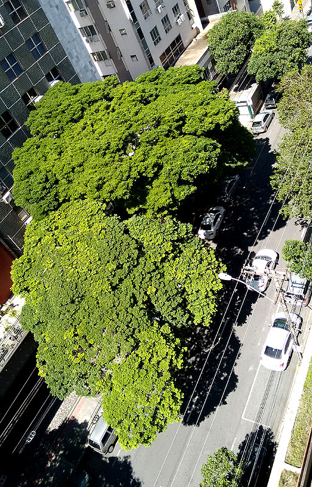
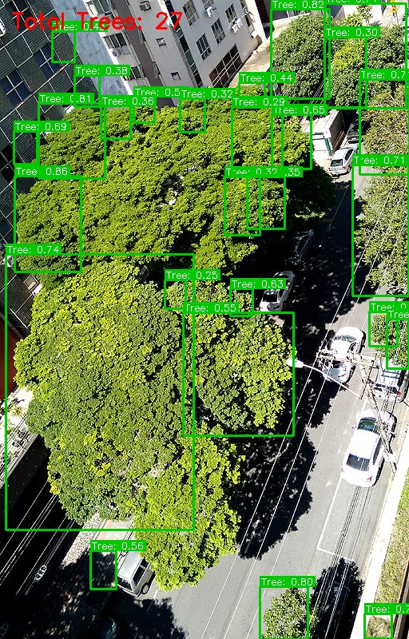

# 🌳 Urban Canopy AI: Detecção e Análise de Árvores em Imagens Aéreas

[](https://www.python.org/)
[](https://github.com/ultralytics/ultralytics)
[](https://onnxruntime.ai/)
[](https://streamlit.io/)
[](https://www.docker.com/)

Este repositório contém um sistema ponta a ponta de Visão Computacional para **detecção de copas de árvores individuais** e **cálculo de cobertura vegetal** a partir de imagens aéreas de alta resolução. 

Originalmente desenvolvido como um projeto de Inteligência Artificial na Universidade de Brasília (UnB) baseado no benchmark de *Zamboni et al. (2021)*, o sistema foi refatorado para padrões de produção de mercado: migrado para **YOLOv8**, otimizado para execução em **CPU através do ONNX Runtime** e empacotado em um **aplicativo interativo Streamlit** dockerizado.

---

## 📸 Demonstração Visual

Abaixo está um exemplo prático do modelo em funcionamento, identificando árvores individuais e desenhando as caixas delimitadoras com seus respectivos scores em uma via urbana:

| Imagem Aérea Original | Resultado da Detecção ($AP_{50}$ = 0.7142) |
| :---: | :---: |
|  |  |

---

## 🚀 Funcionalidades Principais

* **Pipeline de Treinamento K-Fold**: Script automatizado (`train_kfold.py`) que baixa o dataset, converte as anotações do padrão COCO para YOLO, treina os modelos em validação cruzada de 5 folds (no Google Colab) e exporta os resultados.
* **Inferência Otimizada para CPU (ONNX)**: Conversão do modelo PyTorch para o formato ONNX. A inferência é executada usando a biblioteca `onnxruntime` em CPU comuns, obtendo tempos de processamento rápidos sem a necessidade de GPU.
* **Non-Maximum Suppression (NMS) Nativo**: Implementação em NumPy do algoritmo clássico de NMS para pós-processamento eficiente no script `inference_onnx.py`.
* **Interface Web Streamlit (`app.py`)**: Interface interativa que permite ao usuário fazer upload de qualquer imagem aérea, visualizar as caixas delimitadoras, obter a contagem exata de árvores e calcular a **porcentagem exata de cobertura de copa** através de máscaras binárias.
* **Pronto para Nuvem (Docker)**: Configuração dockerizada pronta para deploy no Streamlit Community Cloud, Heroku, AWS ou Google Cloud Run.

---

## 📂 Estrutura do Repositório

```bash
├── app.py                  # Aplicativo frontend interativo (Streamlit)
├── inference_onnx.py       # Script principal de inferência standalone em CPU (ONNX Runtime)
├── train_kfold.py          # Script de preparação e treinamento YOLOv8 (Colab/GPU)
├── Dockerfile              # Dockerfile para empacotamento em containers
├── requirements.txt        # Dependências de execução e produção (leves para CPU)
├── ProjetoIAA.pdf          # Artigo/Relatório científico original do projeto (PDF)
├── YOLO-MS/                # Repositório original com as configurações MMYOLO (Legado)
└── Trabalho.ipynb          # Notebook Google Colab de treinamento do modelo legado (YOLO-MS)
```

---

## 📊 Performance e Métricas de Referência

O modelo YOLOv8s foi treinado utilizando validação cruzada (5 folds) a partir de pesos pré-treinados no COCO. A tabela abaixo apresenta os resultados obtidos em cada fold no conjunto de teste independente:

| Fold (Run) | $mAP_{50}$ Obtido |
| :---: | :---: |
| **Fold 0** | 0.6782 |
| **Fold 1** | 0.7167 |
| **Fold 2** | 0.7198 |
| **Fold 3** | 0.7045 |
| **Fold 4** | 0.7518 |
| **Média $\pm$ Desv. Padrão** | **0.7142 $\pm$ 0.0238** |

### Comparação com os Baselines de Referência:
* YOLO-MS (original do artigo): 0.675
* RetinaNet: 0.686
* Faster R-CNN: 0.700
* **YOLOv8s (Este Trabalho)**: **0.7142** (Superou os baselines one-stage e two-stage do benchmark original!)

---

## 💻 Como Executar o Projeto Localmente

### Pré-requisitos
Apenas o Python 3.8+ instalado (não é necessário ter placa de vídeo GPU ou CUDA configurado para rodar a inferência!).

### 1. Clonar o Repositório e Instalar Dependências
```bash
git clone https://github.com/ineblinavel/Projeto-IAA.git
cd Projeto-IAA
pip install -r requirements.txt
```

### 2. Rodar a Inferência Standalone via Linha de Comando (CLI)
Para rodar a inferência rapidamente em qualquer imagem de teste usando CPU:
```bash
python inference_onnx.py --model yolov8s.onnx --image caminho/para/imagem.jpg --output resultado.jpg
```

### 3. Executar o Aplicativo Web Interativo
```bash
streamlit run app.py
```
Acesse o endereço `http://localhost:8501` no seu navegador para utilizar a aplicação.

---

## 🐳 Executando com Docker

Você também pode empacotar a aplicação em um container Docker, facilitando o deploy em servidores:

```bash
# Construir a imagem Docker
docker build -t urban-canopy-ai .

# Rodar o container
docker run -p 8501:8501 urban-canopy-ai
```
Acesse `http://localhost:8501` no navegador.


